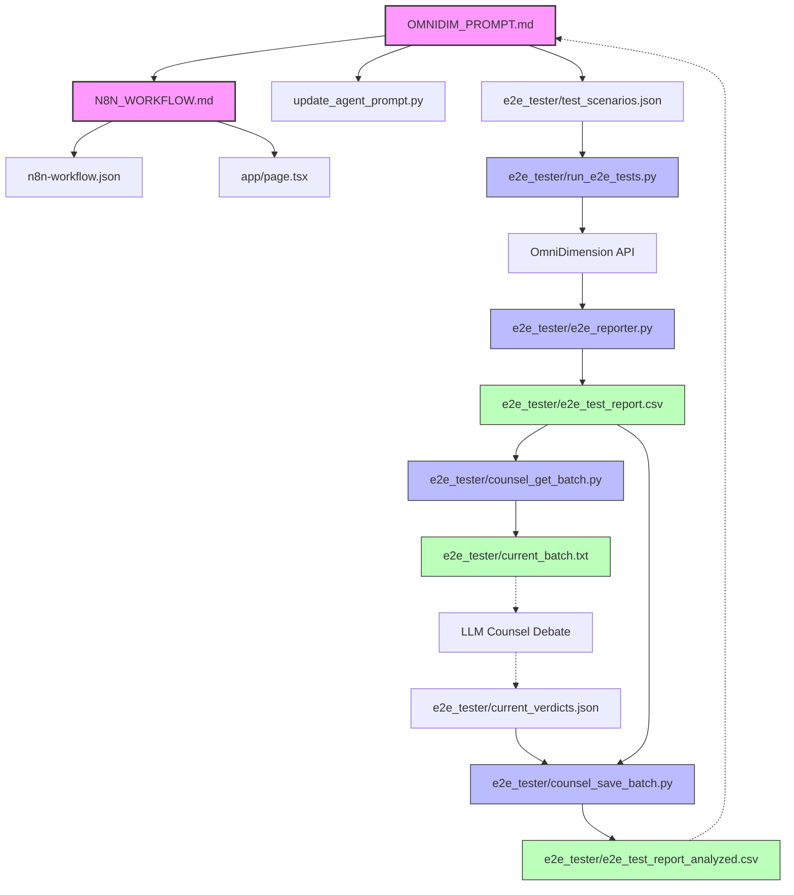

# Voice Agent System Architecture & Dependency Map

This document visually maps all functional components, scripts, and data flows within the Voice Agent ecosystem. It serves as the single source of truth for understanding how files interact and cascade changes.

## Global Dependency Graph

## Architectural Domains

### 1. The Core Engine (Prompt & Orchestration)
The bedrock of the agent's behavior. Any changes here will trigger massive downstream shockwaves.
- `OMNIDIM_PROMPT.md`: The system prompt injected into the LLM. It defines personas, pricing guardrails, and required variables (e.g., `{caller_number}`).
- `update_agent_prompt.py`: The script used to programmatically push `OMNIDIM_PROMPT.md` to the OmniDimension cloud.
- `n8n-workflow.json`: The physical configuration of the orchestration webhooks (e.g., triggering WhatsApp alerts to managers).

### 2. The Simulation & Testing Harness (`e2e_tester/`)
This suite validates the Core Engine. If `OMNIDIM_PROMPT.md` gets a new capability or pricing change, the testing scenarios *must* be updated to test it.
- `test_scenarios.json`: The expected outcomes (e.g., user asks for 50% discount -> AI must refuse).
- `run_e2e_tests.py`: Runs the simulated calls via OmniDimension.

### 3. The Analytics & LLM Counsel Pipeline
The pipeline that grades the agent's performance. It expects strict file formats and schema adherence.
- `e2e_reporter.py`: Pulls raw logs and builds the base `e2e_test_report.csv`.
- `counsel_save_batch.py`: Maps the LLM Counsel's verdicts onto the master CSV to produce `e2e_test_report_analyzed.csv`. If the master CSV schema changes, this script breaks.
